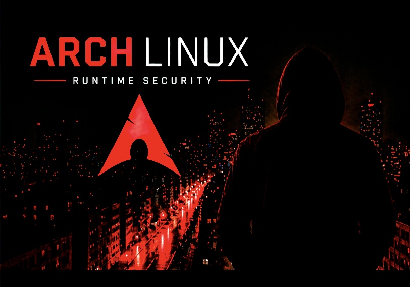
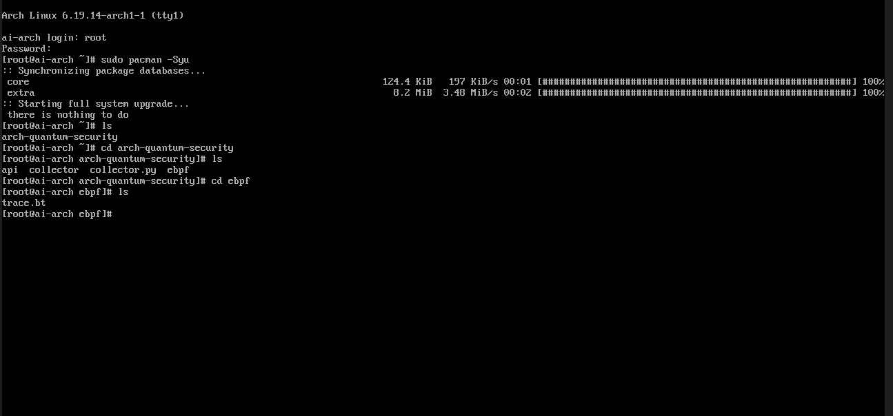
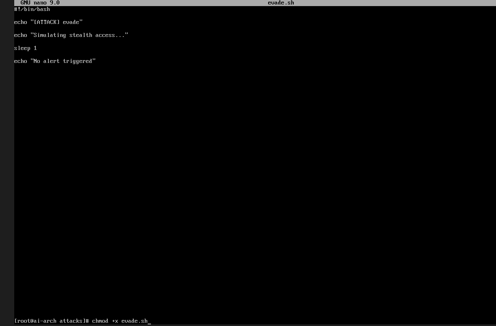
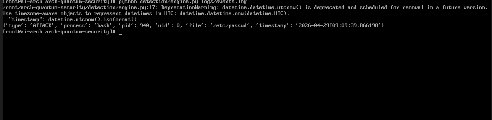

# Arch Linux Runtime Security (eBPF IDS)

  

## Features
- Runtime log monitoring
- Suspicious activity detection
- Simple IDS simulation
- GitHub Actions CI integration

---

## 🔵 Description du projet

Ce projet implémente un mini moteur de détection d’intrusion (IDS) capable d’analyser des logs système afin d’identifier des comportements suspects.

L’objectif est de simuler une activité malveillante, générer des logs, puis les analyser automatiquement afin de détecter des événements critiques.

---

## 🎬 Scénario réel d’utilisation

### 🏢 Contexte

Dans un environnement professionnel, des serveurs Linux contiennent des fichiers sensibles tels que :
- mots de passe (ex : /etc/shadow)
- configurations système
- données utilisateurs

Un attaquant ou un programme malveillant peut tenter d’accéder à ces fichiers de manière non autorisée, parfois sans déclencher d’alerte immédiate.

---

### ⚠️ Problème

Sans système de détection, ces activités peuvent passer inaperçues dans les logs système.

### Solution apportée par le projet

Ce projet simule ce type de comportement et met en place un moteur de détection capable d’identifier :
- les accès avec privilèges élevés (UID 0)
- l’accès à des fichiers sensibles
- les comportements suspects dans les logs

---

## Structure du projet

| Dossier / Fichier | Description |
|------------------|------------|
| `ebpf/`          | Détection au niveau du kernel |
| `detection/`     | Moteur d’analyse des logs |
| `attacks/`       | Simulation d’attaques |
| `tests/`         | Validation du pipeline |
| `logs/`          | Stockage des événements |
| `run.sh`         | Script d'exécution globale |
| `README.md`      | Documentation du projet |

---

## 🟢 Objectifs

- Simuler une attaque système
- Générer des logs exploitables
- Analyser automatiquement les événements
- Détecter des comportements suspects
- Structurer les résultats au format JSON

---

## ⚙️ Architecture du projet

Le projet repose sur un pipeline simple et efficace :

Attack Script → Log File → Detection Engine → Alert

---

## ⚙️ Mise en place de l’environnement

Préparation de l’environnement Arch Linux et vérification de la structure du projet :

  

> Installation des paquets, mise à jour du système et vérification des répertoires du projet.

---

## Pipeline de détection   

### 🔺 1. Simulation d’attaque   

Un script génère un événement simulant une activité malveillante, sous la forme suivante :      
 → ATTACK|bash|940|0|/etc/passwd     

  

---   

### 🔷 2. Stockage des logs   

Les événements sont enregistrés dans :   
 → logs/events.log      

---   

### 🔷 3. Moteur de détection   

Le script principal analyse les logs :   

Ce fichier constitue la source principale pour l’analyse.            
 → python detection/engine.py logs/events.log             

---   

## Fonctionnement interne   

### 🔷 Lecture des logs   

Le moteur lit le fichier ligne par ligne :       
 → with open(sys.argv[1]) as f:           

### 🔷 Filtrage    

Seules les lignes contenant `"ATTACK|"` sont analysées :   
 → if "ATTACK|" in line:      

### 🔷 Parsing    

Chaque ligne est transformée en objet structuré :   

{   
  "type": "ATTACK",   
  "process": "bash",   
  "pid": 940,  
  "uid": 0,  
  "file": "/etc/passwd",  
  "timestamp": "..."   
}   

  

---

 🟩 Détection      

Le moteur applique des règles simples mais efficaces :     

* 🔴 UID = 0 → activité avec des privilèges root      
* 🔴 Accès au fichier sensible  /etc/passwd      

---

🟩 Exemple de sortie :     

 → [ALERT] Root activity detected       
 → [CRITICAL] Sensitive file access

 ---

🟩 Sauvegarde      

Les événements sont enregistrés au format JSON dans :      
 → logs/events.log 

 ---

🔵 Pourquoi “Quantum Security” ?      

Dans ce projet, le terme “Quantum” ne fait pas référence à l’informatique quantique.      

Il représente une approche multi-critères et multi-états de la détection :   

* analyse simultanée de plusieurs attributs système (processus, utilisateur, fichier)  
* corrélation de plusieurs indicateurs  
* évaluation du niveau de risque selon plusieurs règles     

Cette approche permet une détection plus intelligente et contextuelle.

⸻

🔵 Concepts abordés

* Analyse de logs
* Détection d’intrusion (IDS)
* Parsing de données
* Corrélation d’événements
* Structuration JSON

⸻

👥 Cas d’usage

Ce type de système est utilisé par :   

* Analystes SOC (Security Operations Center)
* Administrateurs système
* Équipes cybersécurité
* Entreprises pour la surveillance de leurs systèmes

⸻

 → Points forts

* Pipeline complet (attaque → détection)
* Code clair et structuré
* Détection basée sur des règles simples
* Format JSON exploitable
* Simulation d'attaques réalistes

⸻

⚠️ Limites

* Détection basée sur des règles simples appliquées à des scénarios réalistes
* Pas de traitement en temps réel
* Pas d’interface graphique

⸻

## 🟢 Usage   

Run the script:   
→ python detector.py   

## Example Output   
[+] eBPF IDS started   
[ALERT] Brute force attempt   
[ALERT] Privilege escalation   
[+] Scan complete   

--- 

🔵 Conclusion

Ce projet démontre la mise en place d’un système de détection d’intrusion simplifié capable d’analyser des logs, d’identifier des comportements suspects et de générer des alertes.

Il constitue une base concrète et réaliste pour comprendre les outils et méthodes utilisés en cybersécurité.

Le projet est conçu avec une architecture modulaire lui permettant d’évoluer vers un IDS (Intrusion Detection System), un système de détection d’intrusion chargé d’analyser les événements système afin d’identifier des activités suspectes ou malveillantes.

⸻

## 🔄 Roadmap

Une évolution est prévue avec l’intégration de **eBPF (Extended Berkeley Packet Filter)** pour la collecte d’événements système en temps réel au niveau du kernel Linux.

Cette approche remplacera les logs simulés par des événements réels (exécution de processus, accès fichiers, activités privilégiées) et permettra d’évoluer vers un système de détection d’intrusion en runtime.

---

⚠️ Disclaimer

Ce projet est réalisé à des fins pédagogiques uniquement.
Toutes les activités sont simulées dans un environnement contrôlé.
Toutes les données produites ont été anonymisées.

This project is for educational purposes only.
All outputs have been sanitized.

⸻

## Lexique des outils et concepts utilisés

### 🐍 Python

- python : exécution du moteur de détection
- sys.argv : récupération du fichier en argument
- json.dumps() : conversion en format JSON
- datetime.now(UTC) : génération d’un timestamp
- open() : lecture et écriture de fichiers
- split() : parsing des logs
- if : règles de détection

---

### 🟢 Bash / Linux

- Scripts .sh : simulation d’attaques
- echo : écriture dans les logs
- >> : ajout (append) dans un fichier
- chmod +x : rendre un script exécutable
